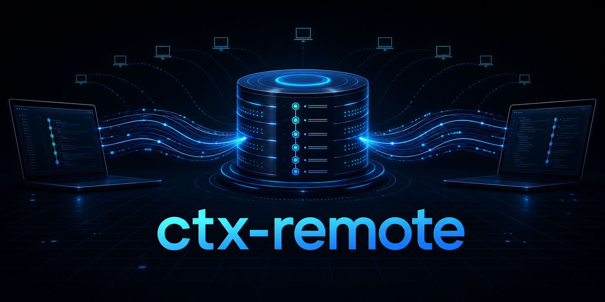
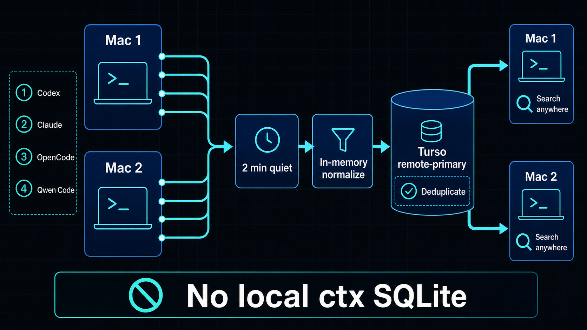

# ctx-remote



**Remote-first shared coding-agent history. One searchable timeline across every Mac.**

ctx-remote collects persisted coding-agent sessions, normalizes them in memory,
and writes them directly to a shared libSQL database. Turso is the primary
store: ctx-remote does not create or maintain a local ctx SQLite index.

Use it when you want to:

- search a conversation from another computer
- merge agent history from multiple Macs without copying database files
- keep the normalized ctx index off local disks
- accumulate new Codex, Claude, OpenCode, and Qwen Code sessions automatically
- give every coding agent the same evidence-backed history

## What makes it different

| | Local ctx | ctx-remote |
| --- | --- | --- |
| Primary index | Local `work.sqlite` | Remote libSQL / Turso |
| Import path | Provider history → local index | Provider history → memory → remote database |
| Multiple Macs | Separate indexes | One merged event timeline |
| Repeated imports | Local refresh | Stable remote deduplication |
| Background operation | Local maintenance | macOS launchd remote sync |
| Credentials | None | `CTX_TURSO_AUTH_TOKEN` database token |
| Local ctx SQLite | Required | Not created |

Provider-owned histories still belong to their applications and remain where
those applications store them. For example, OpenCode may continue to use its
own SQLite database. “No local ctx SQLite” means ctx-remote does not add a
second persistent normalized index, WAL, or SHM file.

## How it works



1. Each Mac reads the provider history already written by its coding agents.
2. A source is imported after it has been quiet for two minutes, or after a
   ten-minute maximum defer window if agents keep writing continuously.
3. Events are normalized in a short-lived, in-memory ctx store.
4. Idempotent batches are written to the shared Turso database.
5. Stable provider, session, and event identities deduplicate copied or shared
   histories.
6. `ctx-remote` searches the same remote projection from either Mac.

The default service checks once per minute. An active source normally waits for
the quiet window, so it is not re-imported on every write. Continuous activity
cannot starve the provider: after ten minutes the service performs an
idempotent import even if another session is still being written.

On macOS the service uses `/etc/ssl/cert.pem` explicitly, avoiding launchd
keychain-access failures while establishing the Turso TLS connection.

## Quick start

### 1. Build ctx-remote

Requirements:

- Rust 1.88 or newer
- the [Turso CLI](https://docs.turso.tech/cli/introduction)
- macOS for the included automatic launchd service

```bash
git clone https://github.com/moto-taka/ctx-remote.git
cd ctx-remote
cargo install --locked --force --path crates/ctx-cli
```

The installed Rust binary remains named `ctx` for compatibility with the
upstream crate and existing scripts. The installer below adds the public
remote-first command, `ctx-remote`.

### 2. Create or select a Turso database

```bash
turso auth login
turso db create your-database
turso db show your-database --url
```

### 3. Enable automatic remote sync

Run this from the repository checkout:

```bash
export CTX_TURSO_AUTH_TOKEN="$(turso db tokens create your-database --expiration never)"

scripts/install-ctx-turso-launchd.sh \
  --database-name your-database \
  --database-url libsql://your-database.turso.io
```

The installer:

- resolves binaries and the current home directory on that Mac
- installs the sync service and `ctx-remote` runner
- stores the database name, database URL, and resolved executable paths
- persists `CTX_TURSO_AUTH_TOKEN` in the mode-600 sync environment file when supplied
- uses the configured database token directly without recurring Turso CLI login
- falls back to one-day tokens from the Turso CLI only when no database token is configured
- enables remote-primary mode without running `ctx setup`
- installs coalesced session-end sync hooks for Claude, Codex, and Qwen Code
- loads shared Hindsight memory into new Qwen Code sessions when Hindsight is installed

Repeat the same installation on another Mac with the same database name and URL.
Both machines will merge into the same event timeline.

### Lifecycle hooks

Agent shutdowns request an immediate provider-specific `ctx turso import`. A shared non-blocking
lock and short debounce merge simultaneous Claude, Codex, and Qwen
Code exits into one sequential worker. Duplicate requests for the same provider
are imported once. The worker runs detached from the agent, retries at
most three times, and records private status under
`~/.local/state/ctx-remote/hook-sync-status.json`. It never creates a local ctx
SQLite database.

```bash
ctx-remote hook-status
ctx-remote hook-sync codex
```

Claude and Qwen Code use their native `SessionEnd` events. Codex reuses the
already trusted Hindsight `Stop` script instead of rewriting protected hook
commands.

If the local Hindsight Codex integration is present, the installer also adds:

- a Qwen Code `SessionStart` hook whose `additionalContext` contains recalled memory

Existing agent hooks are preserved. Re-running the installer is idempotent.

### 4. Search from anywhere

```bash
ctx-remote sync-status
ctx-remote status
ctx-remote search 'failed migration'
ctx-remote search 'deployment' --provider codex
ctx-remote show session <ctx-session-id>
```

When ctx-remote is configured, an empty local `ctx status` is not a reason to
initialize local storage. Use `ctx-remote status`.

## Automatic provider coverage

The included macOS service watches:

| Source | Default location |
| --- | --- |
| Codex | `~/.codex/sessions` |
| Claude Code (`clc`) | `~/.claude/projects` |
| Claude Code alternate (`sclc`) | `~/.claude-sapeet/projects` |
| OpenCode | `~/.local/share/opencode/opencode.db` |
| Qwen Code | `~/.qwen/projects` |

The native foreground importer can also discover and import every provider
adapter inherited from ctx:

```bash
export CTX_TURSO_DATABASE_URL='libsql://your-database.turso.io'
export CTX_TURSO_AUTH_TOKEN="$(turso db tokens create your-database --expiration never)"

ctx turso import --batch-size 100
ctx turso status

unset CTX_TURSO_AUTH_TOKEN
```

See the machine-readable [provider support matrix](docs/provider-support-matrix.json)
and [provider documentation](docs/providers.md) for the complete current list.

## Remote-primary commands

`ctx-remote` loads the installed remote configuration and uses the configured
database token. It is the recommended interactive and agent-facing entry point.

```bash
ctx-remote sync-status
ctx-remote status
ctx-remote import
ctx-remote search '<query>'
ctx-remote show event <ctx-event-id> --window 3
ctx-remote show session <ctx-session-id>
```

The underlying explicit command family is also available:

```bash
ctx turso init
ctx turso import --watch --interval-seconds 60
ctx turso push --batch-size 100
ctx turso search '<query>'
ctx turso status
```

`ctx turso push` is for migrating an existing ctx index. Normal ongoing
operation uses `ctx turso import`, which reads native provider sources through
an in-memory store and does not create a persistent ctx database. Therefore,
`ctx-remote turso push` is not the command for routine automatic sync.

## Storage and merge semantics

- Each import is idempotent and may be retried.
- Imports from multiple Macs are unioned in the remote database.
- Events with stable provider-owned session identities are deduplicated even
  when their source paths differ.
- Histories without a stable provider session ID stay separate rather than
  risk losing valid independent events.
- Provider-owned SQLite sources may be copied to an operating-system temporary
  directory for a consistent read. The copy is removed when the command exits
  and is not a ctx index.
- Transcript payloads may contain local paths, commands, prompts, or secrets
  written by an agent. Protect the Turso database accordingly.

## Current scope

The remote path provides portable event projection, lexical search, status,
import, and show behavior. Local semantic search, raw SQL, MCP, artifact bodies,
and features tied to the full local ctx store are not remote-capable yet.

Turso/libSQL is the first supported remote protocol. Other hosted SQLite
services need a compatible remote libSQL protocol; a database file exposed over
ordinary network storage is not sufficient.

See [remote-primary CLI reference](docs/cli-reference.md#remote-primary-libsql--turso)
and [known limitations](docs/limitations.md#remote-projection-semantics).

## Agent Skill

The included `ctx-agent-history-search` skill detects remote-primary
configuration and uses `ctx-remote`. It does not silently initialize or fall
back to a local ctx database.

Install the skill directory in any compatible agent skill location, or use the
copy installed in `~/.agents/skills/ctx-agent-history-search`:

```text
Use ctx-agent-history-search to find the earlier decision and cite the matching
session before changing the implementation.
```

See [agent skill installation](docs/agent-skill-install.md) and
[agent usage](docs/agent-usage.md).

## Origin and compatibility

ctx-remote is an independently maintained remote-first fork of
[ctxrs/ctx](https://github.com/ctxrs/ctx). It preserves the internal `ctx`
binary, event model, provider adapters, and most CLI contracts so existing
workflows remain usable, while making shared remote storage the primary product
path.

The upstream project remains the source for local-first behavior and its
website documentation. This repository has its own installation path,
remote-primary operating model, release decisions, and README.

## Development

```bash
cargo test
./scripts/check-docs.sh
```

The project is licensed under the [Apache License 2.0](LICENSE).
